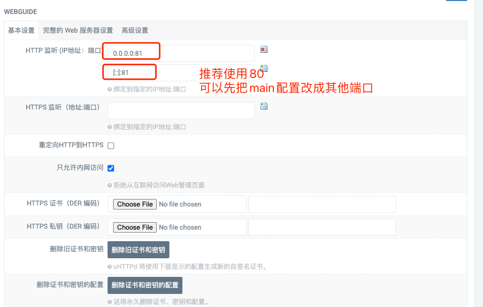
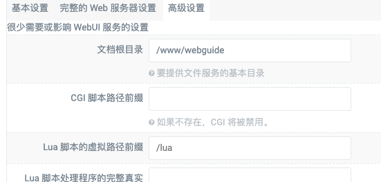
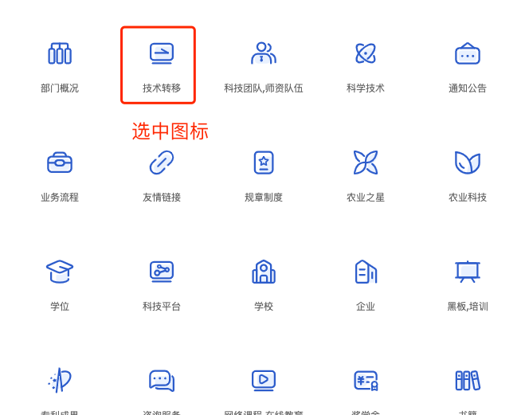
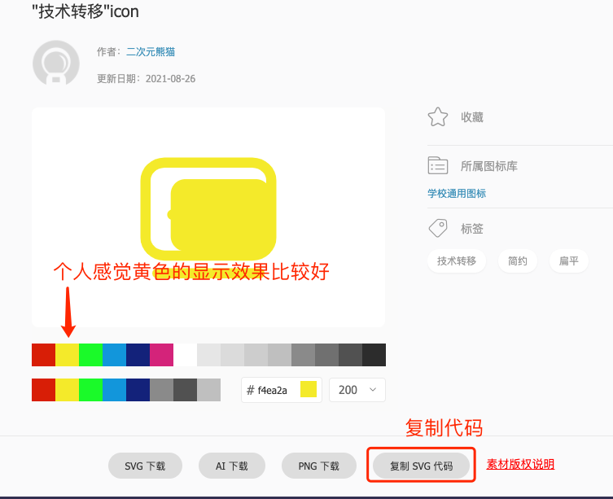
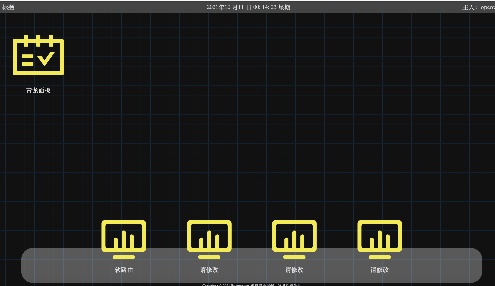

<!--
 * @Description: Editor's info in the top of the file
 * @Author: p1ay8y3ar
 * @Date: 2021-10-10 23:45:54
 * @LastEditor: p1ay8y3ar
 * @LastEditTime: 2021-10-11 13:59:42
 * @Email: p1ay8y3ar@gmail.com
-->
# luci-app-webguide 
一个简单的openwrt导航页luci插件 

## 设置示例
> 示例设置以uhttpd为例

1. web服务器uhttpd设置
   uhttpd添加一个新的web服务,示例配置如下图所示：
   **基本设置**只需要设置http端口
   
   **高级设置**文档根目录一定设置为`/www/webguide`
   
   保存修改后**重启**.
    推荐使用80端口,可先行修改MIAN的端口为其他端口

2. [下载](https://github.com/p1ay8y3ar/luci-app-webguide/releases)并上传插件到op安装,如果服务栏目没有出现`WebGuide`,请尝试重启op.
3. **WebGuide**配置
   配置界面如下
   
   url要填写完整的协议，比如`https://www.baidu.com`
   主要是图标文件的设置:推荐使用阿里巴巴旗下的[iconfont](https://www.iconfont.cn/)
    选中心仪的图标
    

    复制svg代码粘贴到设置界面即可
    
    
    底部和主页都至少配置一个,大概的显示效果如下:
    

html页面来自[nas-home-page](https://github.com/blqw/nas-home-page),再次感谢！

# TODO 
- [ ]  独立web服务器,有些arm固件没有编译uhttpd插件